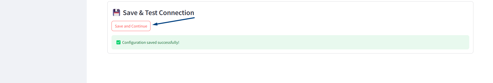
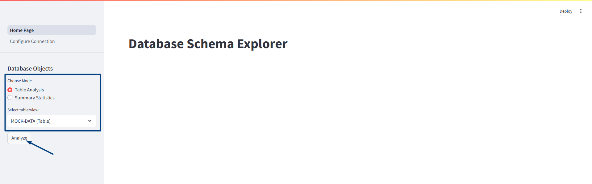

<<<<<<< HEAD
# 📊 DataProfiler

A Streamlit web app to explore and analyze database schemas — supports PostgreSQL, MySQL, MSSQL, and Oracle.  
It allows you to connect to a database, view tables and views, analyze their structure, and see summary statistics.

---

## 🚀 Features

- 🔗 Connect to PostgreSQL, MySQL, MSSQL, or Oracle
- 🛠️ Edit or create connection settings through the app interface
- 📋 List tables and views in selected schema
- 📈 View summary statistics for all tables
- 🔎 Detailed analysis of individual tables

---

## 🏁 Getting Started

### 1. Clone the repository

```bash
git clone https://github.com/your-username/DataProfiler.git
cd DataProfiler```

### 2. Set up virtual environment
```bash
python -m venv .venv
source .venv/bin/activate  # On Windows: .venv\Scripts\activate
```
### 3. Install dependencies
```bash
pip install -r requirements.txt
```
### 4. Run the app
```bash
streamlit run main.py
```

⚙️ How-To Use

### 1. Configure the Database Connection
On first launch, click **"Configure Profile"** to create or edit your database connection settings.

Example config:
```ini
[database]
type = postgres
host = localhost
port = 5432
dbname = your_db
user = your_user
password = your_password
schema = public
```


Fill in your database details and click the **"Save and Continue"** button to proceed.


### 2. Explore the Database
Navigate to the Home Page. In the **Database Objects** sidebar, choose between:

- **Table Analysis:** Analyze specific tables

- **Summary Statistics:** Get an overview of all tables in the selected schema

To analyze a specific table, select it from the dropdown and click **"Analyze".**



### 3. View Table Insights
In Table Analysis, you can explore two tabs for each column:

- 📊 **Statistics:** Displays metrics like total rows, unique ratio, min, max, mean, median, etc.

- 📈 **Data Distribution:** Visualizes the column's histogram and value composition

### 4. View Schema Summary
In Summary Statistics, get a brief overview of the entire schema, including row counts, null percentages, and other useful metadata.


=======
# data-profiler
Data Profiler
>>>>>>> 65282dd888f4c58eaad69c58b9fc40d4cdfa53b9
