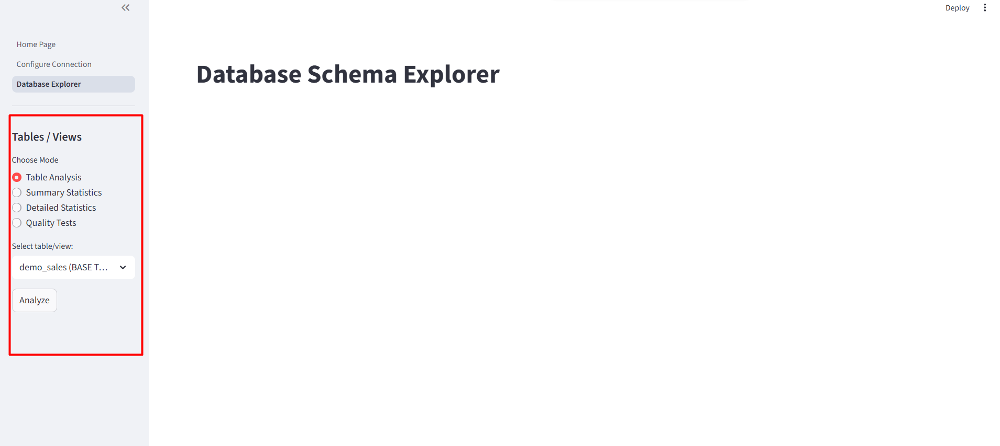
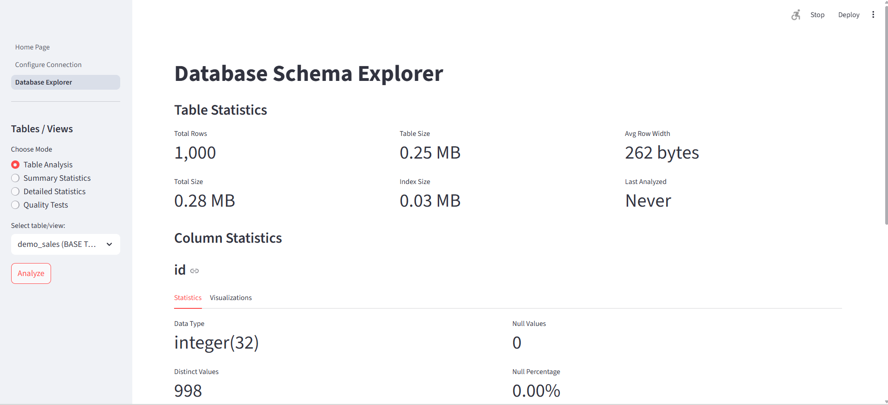
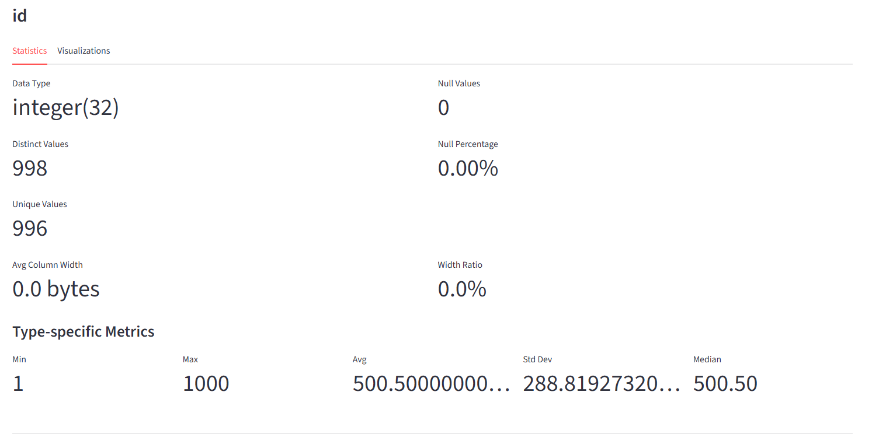
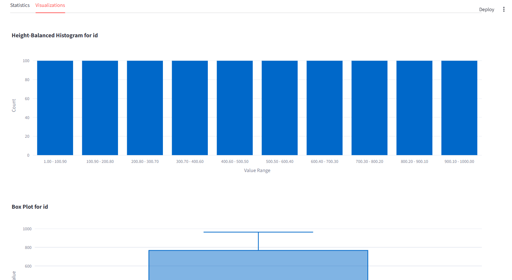
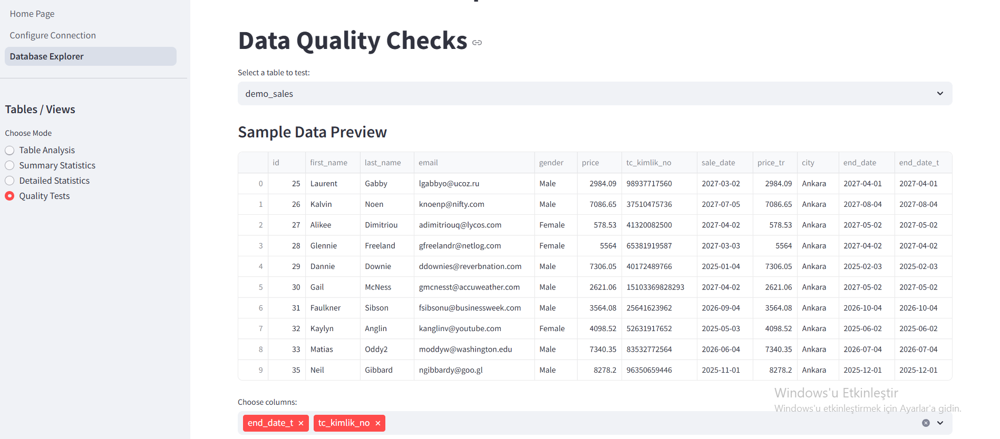
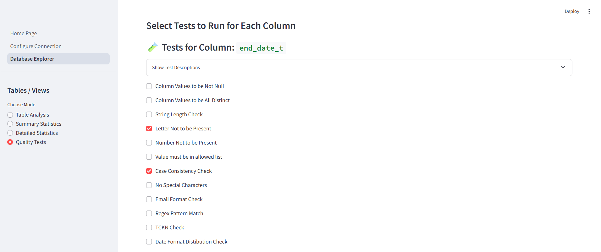
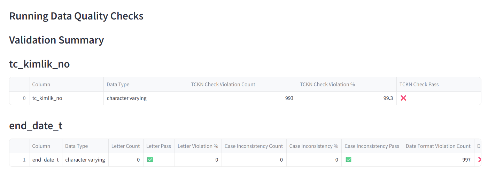
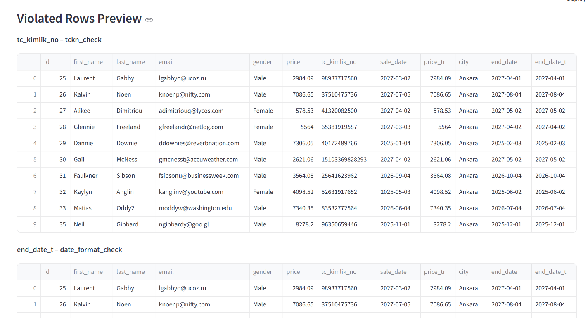

# 📊 DataProfiler

A Streamlit web app to explore and analyze database schemas — supports PostgreSQL, MySQL, MSSQL, and Oracle.  
It allows you to connect to a database, view tables and views, analyze their structure, and see summary statistics.

---

## 🚀 Features

🔗 Multi-DB Support: Connect to PostgreSQL, MySQL, MSSQL, or Oracle

🛠️ Easy Connection Management: Edit or create connection settings in-app

📋 Schema Exploration: List tables and views in your selected schema

🔎 Table Drilldown: Detailed analysis of individual tables

📈 Summary Stats: View summary statistics for all tables

📈 Detailed Schema Stats: View details statistics for all tables/columns and export as Excel file.

📈 Data Quality Tests: VDefine validation rules and visualize pass/fail metrics


---

## 🏁 Getting Started

### Prerequisites

- Python 3.8+
- Streamlit
- Relevant database drivers (e.g., `psycopg2-binary`, `pymysql`, `pyodbc`, `cx_Oracle`)

### 1. Clone the repository

```bash
git clone https://github.com/your-username/DataProfiler.git
cd DataProfiler```

### 2. Set up virtual environment
```bash
python -m venv .venv
source .venv/bin/activate  # On Windows: .venv\Scripts\activate
```
### 3. Install dependencies
```bash
pip install -r requirements.txt
```
### 4. Run the app
```bash
streamlit run Home_Page.py
```

⚙️ How-To Use

### 1. Configure the Database Connection
On first launch, click **"Configure Profile"** to create or edit your database connection settings.

Example config:
```ini
[database]
type = postgres
host = localhost
port = 5432
dbname = your_db
user = your_user
password = your_password
schema = public
```


Fill in your database details and click the **"Test"** button, then **"Save and Continue"** button to proceed.


### 2. Explore the Database
Navigate to the Home Page. In the **Database Objects** sidebar, choose between:

- **Table Analysis:** Analyze specific tables

- **Summary Statistics:** Get an overview of all tables in the selected schema

- **Detailed Statistics:** Get an detailed analysis of all tables and columns in selected schema

- **Data Quality Checks:** Analyze your data for common data quality issues with a configurable and interactive UI



To analyze a specific table, select it from the dropdown and click **"Analyze".**


### 3. View Table Analysis
In Table Analysis, you can explore two tabs for each column:

- 📊 **Statistics:** Displays metrics like total rows, unique ratio, min, max, mean, median, etc.



- 📈 **Data Distribution:** Visualizes the column's histogram and value composition



### 4. View Summary Statistics
In Summary Statistics, get a brief overview of the entire schema, including row counts, null percentages, and other useful metadata.

### 5. View Detailed Statistics
In Detailed Statistics, get a detailed overview of the entire schema, including row counts, null percentages, PK, FK, References, Index Size, Table Size and other useful metadata.

### 6. Run Data Quality Tests

Easily run comprehensive data quality tests on any table and columns in your connected database:

- Select your target table and columns interactively.


- Pick from a rich set of validation rules for each selected column: null, distinct, ranges, patterns, email/date formats, Turkish ID check, and more.


- Configure test parameters (e.g., allowed values, min/max, date ranges) from the UI if needed.
- Review a full summary table of pass/fail and violation percentages.


- Preview up to 100 violating rows per test.


